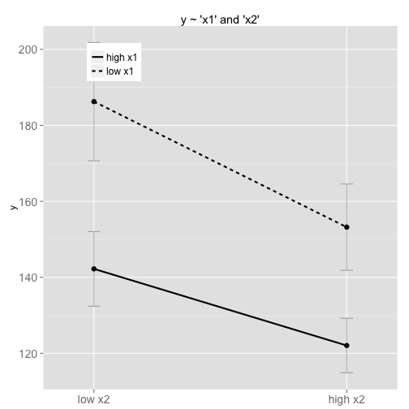

## F00!


```r
setwd("/Users/idm/Work/i0")
library(devtools)
load_all()
```

```
## Loading i0
```

```
## Loading required namespace: ggplot2
```

```
## Loading required package: stringr
```


```r
data = data.frame(y = c(0, 1, 2), x1 = c(2, 4, 6), x2 = c(3, 6, 9))
t = target(y ~ x1 * x2, data = data)
```


```r
d = c(5, 6, 3, 5, 4, 7, 6, 2, 6, 5)
```


```r
data(simulated_gaussian_categorical_data)
d = simulated_gaussian_categorical_data
```


```r
data(simulated_gaussian_data)
d = simulated_gaussian_data
t = target(y ~ x1 + x2 + x1 * x2, data = d)
plot(t)
```

```
## 'opts' is deprecated. Use 'theme' instead. (Deprecated; last used in
## version 0.9.1)
```

```
## Setting the plot title with opts(title="...") is deprecated.  Use
## labs(title="...") or ggtitle("...") instead. (Deprecated; last used in
## version 0.9.1)
```

```
## 'opts' is deprecated. Use 'theme' instead. (Deprecated; last used in
## version 0.9.1)
```

```
## 'theme_blank' is deprecated. Use 'element_blank' instead. (Deprecated;
## last used in version 0.9.1)
```

```
## 'opts' is deprecated. Use 'theme' instead. (Deprecated; last used in
## version 0.9.1)
```

```
## 'opts' is deprecated. Use 'theme' instead. (Deprecated; last used in
## version 0.9.1)
```

```
## theme_text is deprecated. Use 'element_text' instead. (Deprecated; last
## used in version 0.9.1)
```

```
## 'opts' is deprecated. Use 'theme' instead. (Deprecated; last used in
## version 0.9.1)
```

```
## theme_text is deprecated. Use 'element_text' instead. (Deprecated; last
## used in version 0.9.1)
```

```
## 'opts' is deprecated. Use 'theme' instead. (Deprecated; last used in
## version 0.9.1)
```

```
## theme_text is deprecated. Use 'element_text' instead. (Deprecated; last
## used in version 0.9.1)
```

 

